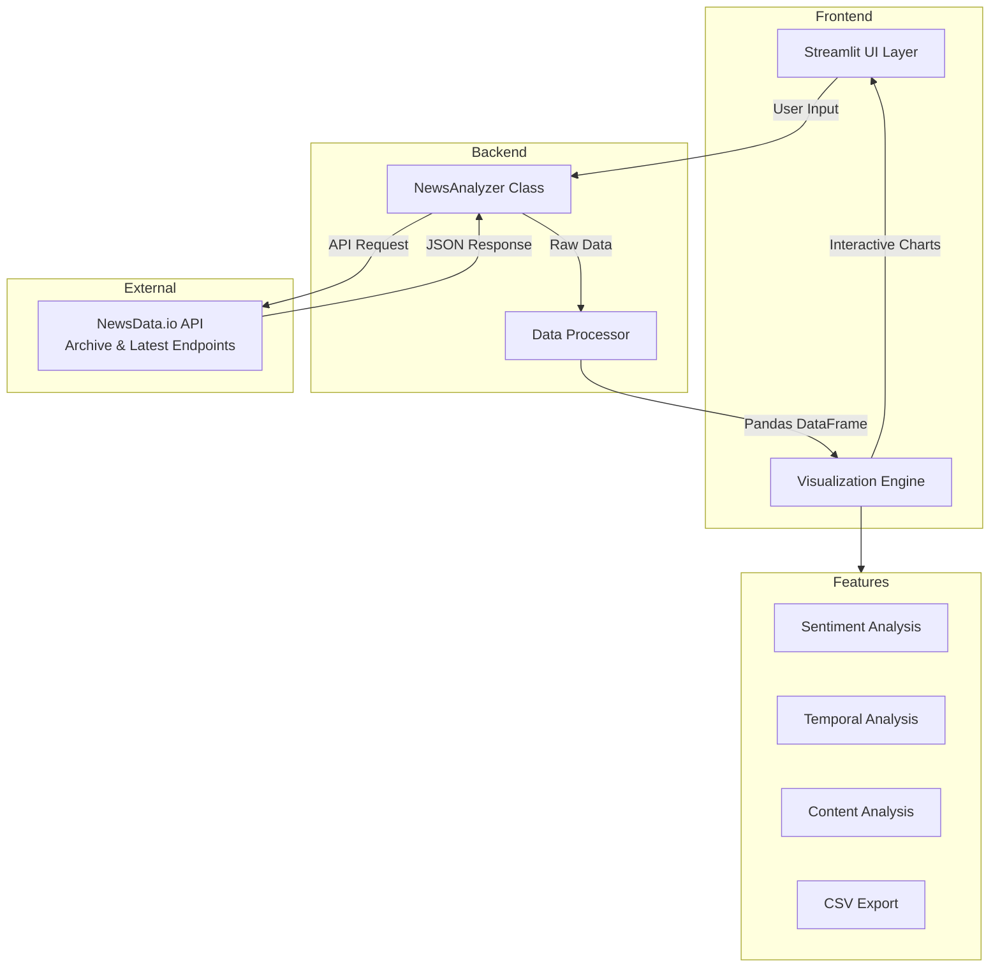

# News Intelligence Dashboard

## System Overview
The News Intelligence Dashboard is a Streamlit-based application that connects to the NewsData.io API to fetch, analyze, and visualize news articles in real-time. The system provides comprehensive sentiment analysis, temporal trends, and content distribution insights through interactive visualizations.

## Table of Contents
- [Getting Started](#getting-started)
- [Architecture Diagram](#architecture-diagram)
- [Component Details](#component-details)
- [API Endpoints](#api-endpoints)
- [Data Flow](#data-flow)
- [Key Technologies](#key-technologies)
- [Features](#features)
- [Usage Guide](#usage-guide)
- [License](#license)

## Getting Started

### Prerequisites
Before running the News Intelligence Dashboard, ensure you have:
- Python 3.8 or higher
- pip (Python package installer)
- NewsData.io API key (get free key at [newsdata.io](https://newsdata.io))

### Installation
1. Clone the repository
   ```bash
   git clone https://github.com/bytesview/ml_resources.git
   cd Transforming News Data Into Actionable Insights
   ```

2. Set up virtual environment
   ```bash
   # Windows
   python -m venv venv
   .\venv\Scripts\activate

   # macOS/Linux
   python3 -m venv venv
   source venv/bin/activate
   ```

3. Install dependencies
   ```bash
   pip install streamlit pandas plotly requests
   ```

4. Run the application
   ```bash
   streamlit run app.py
   ```

5. Open your browser and navigate to `http://localhost:8501`

## Architecture Diagram



## Component Details

### Frontend Layer

1. **Streamlit UI Layer**
   - **Configuration Panel**: API key input and endpoint selection
   - **Search Parameters**: Keyword input, region filter, date range selector
   - **Dashboard Metrics**: Total articles, unique sources, regions covered, days covered
   - **Interactive Tabs**: Sentiment, Temporal, and Content analysis views
   - **Data Export**: CSV download functionality

2. **Visualization Engine**
   - **Sentiment Charts**: Pie chart showing positive/negative/neutral distribution
   - **Temporal Analysis**: Line chart of publication time distribution
   - **Content Analysis**: Bar chart of top 10 news sources
   - **Article Table**: Clickable article titles with metadata

### Backend Layer

1. **NewsAnalyzer Class**
   - **API Integration**: Hard-coded connection to NewsData.io (https://newsdata.io/api/1)
   - **Parameter Validation**: Input validation for keywords and date ranges
   - **Pagination Handling**: Automatic fetching of multiple pages
   - **Region Filtering**: Client-side filtering by AI-detected regions
   - **Error Handling**: Comprehensive error management and user feedback

2. **Data Processing Layer**
   - **JSON Transformation**: Converts API response to structured DataFrame
   - **Data Enrichment**: Adds date-based features (hour, day_of_week)
   - **Deduplication**: Removes duplicate articles based on title
   - **Feature Engineering**: Creates analysis-ready data structure

## API Endpoints

### Archive Endpoint
- **Purpose**: Historical news search with custom date ranges
- **Date Range**: Up to 2 years back from current date
- **Parameters**: keyword, region filter, from_date, to_date
- **Use Case**: Long-term trend analysis, historical research

### Latest Endpoint
- **Purpose**: Most recent news articles
- **Date Range**: Automatically fetches latest articles (no date parameters)
- **Parameters**: keyword, region filter only
- **Use Case**: Real-time monitoring, breaking news analysis

## Data Flow

1. **User Input Collection**
   ```
   User Input → Parameter Validation → API Configuration
   ```

2. **Data Retrieval Process**
   ```
   API Request → Pagination Loop → JSON Response → Region Filtering
   ```

3. **Data Processing Pipeline**
   ```
   Raw JSON → DataFrame Creation → Feature Engineering → Deduplication
   ```

4. **Analysis & Visualization**
   ```
   Processed Data → Statistical Analysis → Interactive Charts → User Dashboard
   ```

## Key Technologies

| Technology | Purpose | Documentation |
|------------|---------|---------------|
| **Streamlit** | Web application framework | [docs.streamlit.io](https://docs.streamlit.io/) |
| **Pandas** | Data manipulation and analysis | [pandas.pydata.org](https://pandas.pydata.org/docs/) |
| **Plotly Express** | Interactive data visualization | [plotly.com/python](https://plotly.com/python/getting-started/) |
| **Python Requests** | HTTP API communication | [docs.python-requests.org](https://docs.python-requests.org/) |
| **NewsData.io API** | News data source | [newsdata.io](https://newsdata.io/documentation) |

## Features

### Core Analytics
- **Sentiment Analysis**: Automatic classification of article sentiment
- **Temporal Trends**: Publication time distribution and patterns
- **Source Analysis**: News source diversity and distribution
- **Regional Coverage**: Geographic analysis of news coverage

### Data Management
- **Real-time Processing**: Live data fetching with progress tracking
- **Pagination Support**: Automatic handling of large datasets
- **Data Export**: CSV download for external analysis
- **Error Recovery**: Robust error handling and user feedback

### User Experience
- **Interactive Dashboard**: Responsive charts and metrics
- **Flexible Search**: Keyword and region-based filtering
- **Endpoint Selection**: Choose between historical and latest news
- **Progress Tracking**: Real-time feedback during data fetching

## Usage Guide

### Basic Search
1. Enter your NewsData.io API key in the sidebar
2. Select endpoint (Archive or Latest)
3. Enter a search keyword (required)
4. Optionally select a region filter
5. For Archive: Choose date range (max 2 years)
6. Click "Search News"

### Advanced Features
- **Region Filtering**: Select from 180+ countries for targeted analysis
- **Date Range Selection**: Archive endpoint supports custom date ranges
- **Data Export**: Download processed data as CSV for further analysis
- **Real-time Updates**: Progress tracking during data fetching

### Best Practices
- Use specific keywords for focused results
- Combine keyword and region filters for targeted analysis
- Use Archive endpoint for trend analysis over time
- Use Latest endpoint for real-time monitoring
- Export data for deeper analysis in other tools

## Error Handling
The application includes comprehensive error handling for:
- Invalid API keys or network issues
- Malformed date ranges or parameters
- API rate limiting and timeout scenarios
- Empty result sets and data processing errors

## Performance Considerations
- Pagination automatically handles large datasets
- Client-side region filtering for responsive experience
- Progress tracking for long-running operations
- Efficient DataFrame operations for data processing

## License
This project is licensed under the MIT License - see the LICENSE file for details.

The MIT License is a permissive license that allows you to use, modify, and distribute this software freely, as long as you provide attribution to the original authors and don't hold them liable for any issues.

---

## Support
For issues or questions:
1. Check the [NewsData.io documentation](https://newsdata.io/documentation)
2. Review the error messages in the application
3. Ensure your API key is valid and active
4. Verify your search parameters are within acceptable limits