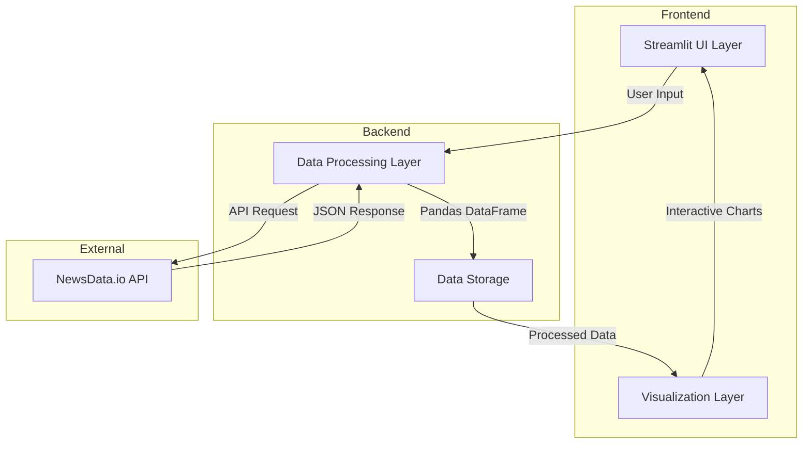

# News Intelligence Dashboard Architecture

## System Overview
The News Intelligence Dashboard is built on a modern, layered architecture that processes and visualizes news data in real-time. This document outlines the complete system architecture and the interaction between different components.

## Table of Contents
- [Getting Started](#getting-started)
- [Architecture Diagram](#architecture-diagram)
- [Component Details](#component-details)
- [Data Flow](#data-flow)
- [Key Technologies](#key-technologies)
- [Features](#features)
- [License](#license)

## Getting Started

### Prerequisites
Before running the News Intelligence Dashboard, ensure you have:
- Python 3.10.14 or higher
- pip (Python package installer)
- Git (for cloning the repository)

### Quick Start
1. Clone the repository
   ```bash
   git clone <your-repository-url>
   cd Transforming News Data Into Actionable Insights
   ```

2. Set up virtual environment
   ```bash
   # Windows
   python -m venv venv
   .\venv\Scripts\activate

   # macOS/Linux
   python3 -m venv venv
   source venv/bin/activate
   ```

3. Install dependencies
   ```bash
   pip install -r requirement.txt
   ```

4. Set up environment variables
   ```bash
   Add your API key in .env file
   ```

5. Run the application
   ```bash
   streamlit run app.py
   ```

## Architecture Diagram


## Component Details

### Frontend Layer
The frontend consists of two main components:

1. **Streamlit UI Layer**
   - Handles user interactions and input collection
   - Provides responsive layout management
   - Renders interactive visualizations
   - Manages state and session data

2. **Visualization Layer**
   - Creates interactive charts using Plotly Express
   - Processes data for visual representation
   - Handles real-time updates
   - Manages chart interactions and events

### Backend Layer
The backend layer manages data processing and storage:

1. **Data Processing Layer**
   - Validates user input
   - Makes API requests to NewsData.io
   - Transforms raw JSON data into structured format
   - Handles error cases and edge conditions

2. **Data Storage Layer**
   - Maintains session-based data storage
   - Manages DataFrame operations
   - Handles data caching
   - Provides data access patterns

### External Services
The system integrates with:

1. **NewsData.io API**
   - Provides raw news data
   - Handles authentication
   - Manages rate limiting
   - Supports pagination

## Data Flow

1. **Input Processing**
   - User enters search parameters
   - System validates input
   - Parameters are formatted for API request

2. **Data Retrieval**
   - System sends request to NewsData.io
   - Handles pagination for large datasets
   - Processes API response
   - Transforms JSON to DataFrame

3. **Data Analysis**
   - Analyzes sentiment patterns
   - Processes temporal data
   - Aggregates regional information
   - Generates statistical summaries

4. **Visualization**
   - Creates interactive charts
   - Updates real-time metrics
   - Renders data tables
   - Handles user interactions

## Key Technologies
- **[Streamlit](https://docs.streamlit.io/)**: Frontend framework
- **[Pandas](https://pandas.pydata.org/docs/)**: Data processing
- **[Plotly Express](https://plotly.com/python/getting-started/)**: Data visualization
- **[Python Requests](https://pypi.org/project/requests/)**: API communication

## Features
- Real-time news data processing
- Interactive data visualizations
- Sentiment analysis
- Temporal data analysis
- Regional information aggregation
- Statistical summaries

## License
This project is licensed under the MIT License - see the LICENSE file for details.
The MIT License is a permissive license that is short and to the point. It lets people do anything they want with your code as long as they provide attribution back to you and don't hold you liable.